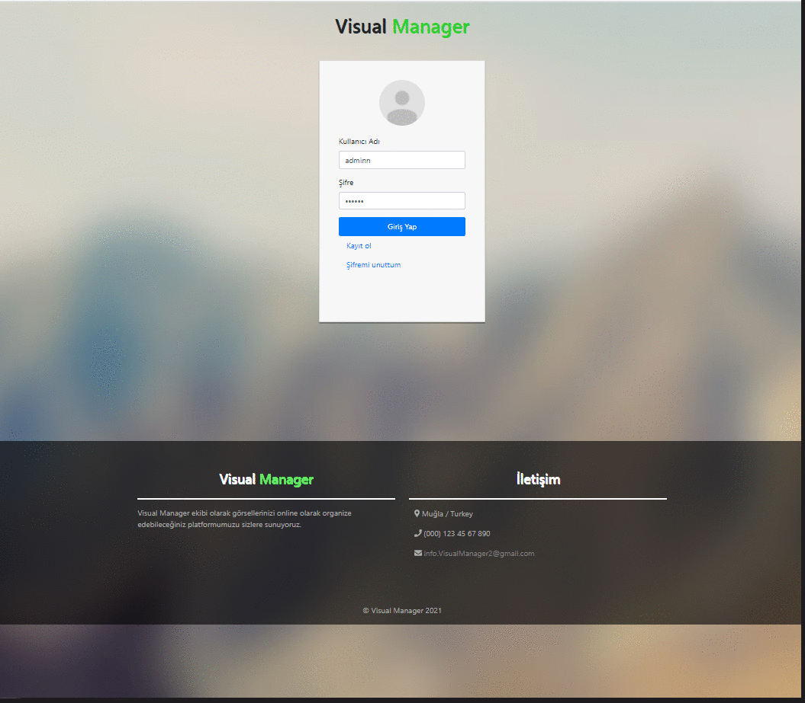

# Visual-manager
 

## What is visual-manager ?
---
Visual-manager is an online gallery application that makes it easy for you to manage your images.
The backend part of the project was developed with **Spring Boot** and the frontend part was developed with **Vue**.
## The goal of the project
---
* Making sure you find what you need among hundreds of images
* Allowing you to edit images
* Categorizing your images without your intervention
* Interactions with social media

## v1.0 Features
---
- Registration and login to the system
- Uploading images to the system and manually categorizing images
- Images can be uploaded to the system, categorized manually, and the desired image can be accessed using categories.

## Requirements
---
* **Java 8**
* **Node.Js**
* **Maven**
* **Vue.js**
* **Mysql8**

## dependencies
---
**Backend:**
* `spring-boot-starter-data-jpa`
* `spring-boot-starter-security`
* `spring-boot-starter-mail`
* `spring-boot-starter-web`
* `mysql-connector-java`
* `jjwt`
* `imgscalr-lib`

**Frontend:**
* `vue`
* `vue-router`
* `vuex`
* `vuelidate`
* `vue2-dropzone`
* `vue-sweetalert2`
* `bootstrap-vue`
* `vue-fontawesome`

## Setup
---
* Clone this repository and run following commands.
    `cd frontend`
    `npm install`

* Create a database named **visual_manager**.
* Visit `src/main/resources/db.properties` and change database username and password.
* Visit `src/main/resources/email.properties` and change email and password.

## Usage
---
Follow the instructions below to run the application.
* Use `cd frontend` firstly and you can run  `npm run dev` to start the application. You will then be able to access it at localhost:8080

* Run `src\main\java\com\application\backend\BackendApplication.java`. Backend application will start running at port 3000.

* Visit http://localhost:8080. You will see the login and registration page. You can log in to the system using the administrator information below, or you can create a new account.
    >Username: admin
    >Password: 123456

* Users who log in to the system see the home page. On the main page, the user can upload their images to the system and images that do not have any category (tag) will be listed here.

* All images of the user are listed on the gallery page and the user can access the images by querying the categories (tags).

* Users can view and update user information by visiting the profile page and and users can view their progress on little tasks in the scoreboard.

* If the user who logs into the system is admin, the router of the admin page is added to the navigation bar. The admin page is the page where the administrator can change the status of user accounts actively or passively, where users can delete their accounts and view the tags that users add to images.

